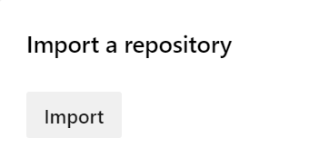
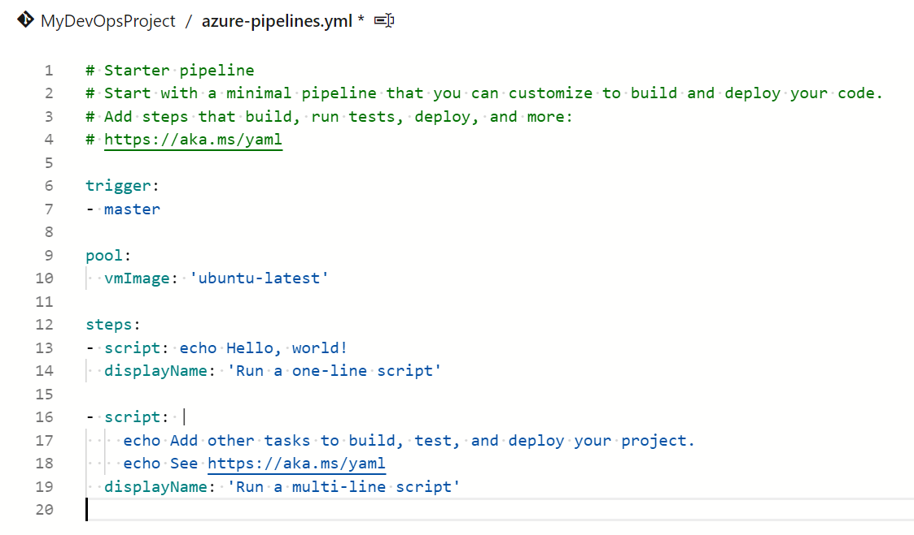

# Lab 1 - Introduction
In Lab 1 we are starting with an introduction into Pipelines-as-Code with Azure DevOps by building a first, basic Pipeline using the Azure DevOps Website. 

> Goto Azure DevOps, select your Organization and click on your previously created Project. If you have not create an Organization and a Project in Azure DevOps, please start with the preparation tasks in our [Before you start](labs/lab0/before-you-start.md) guide.

## Create a YAML-Pipeline via GUI
Before we can start building our first pipeline, we need a Repository in Azure DevOps. 

> **What is Azure Repos?**   Azure Repos is a set of version control tools that you can use to manage your code. Whether your software project is large or small, using version control as soon as possible is a good idea.  Version control systems are software that help you track changes you make in your code over time. As you edit your code, you tell the version control system to take a snapshot of your files. The version control system saves that snapshot permanently so you can recall it later if you need it. Use version control to save your work and coordinate code changes across your team. Goto [docs.microsoft.com](https://docs.microsoft.com/azure/devops/repos/get-started/what-is-repos?view=azure-devops) to learn more.

To initialize the default repository we have in our DevOps Project, click on **Repos** -> **Files** and select **Import a repository**.

Here we're now importing the Lab Repository from GitHub:

**Settings:**
* Repository type: Git
* Clone URL: https://github.com/heoelri/adopac.git

And click on "Import".

This will now import the whole Repository from GitHub into your new Azure DevOps Repository.

## Use the assistant to add tasks

* Click on "Pipelines"
* Click on "Pipelines"
* Click on "Create Pipeline"

In the "Where is your code?" section:

* Click "Azure Repos Git (YAML)

In the "Select a repository" section:

* Select "MyDevOpsProject" (or the name you selected for your DevOps project)

In the "Configure your pipeline" section:

* Select "Starter pipeline" 

This will now create a new basic YAML-based pipeline for you.

## Run your pipeline

Now that we have created our very first "Starter pipeline"

* Click "Save and run"

to save the pipeline in your repository and run it. "Save and run" will ask you for a "Commit message" to describe your change in your repository:

You can also select if you want to write your change into the master branch or if you want to create another branch for your change.

> **What is a Branch?** 
> Branches are lightweight references that keep a history of commits and provide a way to isolate changes for a feature or a bug fix from your master branch and other work. Committing changes to a branch doesn't affect other branches. You can push and share branches with other people on your team without having to merge the changes into master. 
> To learn more about branches, goto [docs.microsoft.com](https://docs.microsoft.com/azure/devops/repos/get-started/key-concepts-repos?view=azure-devops#branch).

## Analyze the output

## Extend your pipeline with variables

## Check the pipeline within your repository