# Lab 1 - Introduction

In Lab 1 we are starting with an introduction into Pipelines-as-Code with Azure DevOps by building a first, basic Pipeline using the Azure DevOps Portal.

> Goto Azure DevOps, select your Organization and click on your previously created Project. If you have not create an Organization and a Project in Azure DevOps, please start with the preparation tasks in our [Before you start](/labs/lab0/before-you-start.md) guide.

## 1.1 Create a YAML-Pipeline via GUI

### 1.1.1 Enable Multi-stage pipelines

At the time of writing this lab guide 'Multi-stage pipelines' is still a preview feature which is not always and everywhere enabled by default. In order to enable the same follow the below steps.

1. On the top right corner of your Azure DevOps portal click on `Settings` and then `Preview Features`

    

    

1. In the preview features pane turn 'on' `Multi-stage pipelines` for you as a user.

    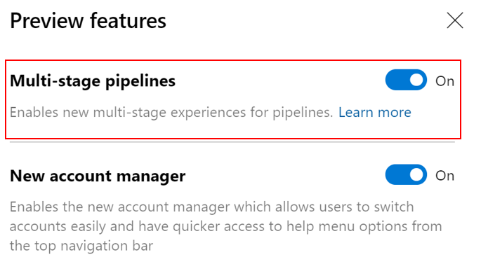

### 1.1.2 Import our Repository from GitHub

Before we can start building our first pipeline, we need a Repository in Azure DevOps.

> **What is Azure Repos?**  
> Azure Repos is a set of version control tools that you can use to manage your code. Whether your software project is large or small, using version control as soon as possible is a good idea.  
> Version control systems are software that help you track changes you make in your code over time. As you edit your code, you tell the version control system to take a snapshot of your files. The version control system saves that snapshot permanently so you can recall it later if you need it. Use version control to save your work and coordinate code changes across your team.  
> Goto [docs.microsoft.com](https://docs.microsoft.com/azure/devops/repos/get-started/what-is-repos?view=azure-devops) to learn more.

1. To initialize the default repository we have in our DevOps Project, click on **Repos** -> **Files**.

    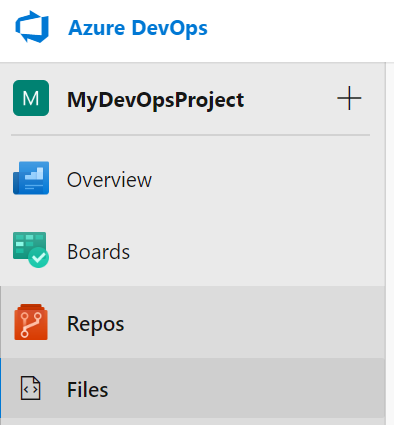

1. and select **Import a repository**

    

1. We are now importing the Lab Repository from GitHub:

    

    **Settings:**

    * Repository type: Git
    * Clone URL: `https://github.com/heoelri/adopac.git`

1. And click on "Import".

    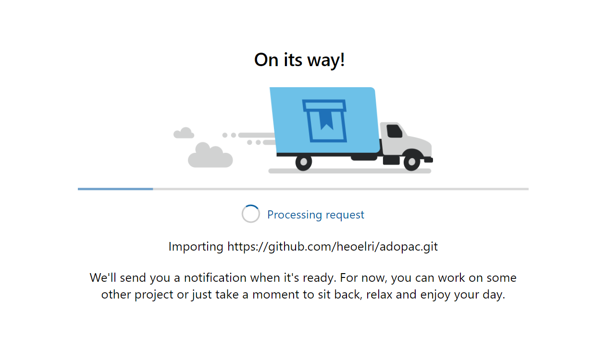

This will now import the whole Repository from GitHub into your new Azure DevOps Repository.

### 1.1.3 Create a Starter pipeline

Lets now get started with creating our starter pipeline.

1. Click on "Pipelines"
1. Click on "Pipelines"
1. Click on "Create Pipeline"

    In the "Where is your code?" section:

1. Click "Azure Repos Git (YAML)

    In the "Select a repository" section:

1. Select "MyDevOpsProject" (or the name you selected for your DevOps project)

    In the "Configure your pipeline" section:

1. Select "Starter pipeline"

    This will now create a new basic YAML-based pipeline for you.

    

What you can see above is a very simple pipeline that contains only a few pieces. Let's quickly go through the items we can see there:

* **trigger** define which changes or actions will trigger our current pipeline. We will cover triggers in more detail in one of the next labs.
* **pool** defines the setup of our build agent that is used to run our pipeline. You can configure things like managed or unmanaged agents, the operating system and other things.
* The **steps** section contains one or more tasks.
* **script** is an alias for a script task that can execute bash commands and scripts.

Our complete pipeline is defined in YAML. To learn the basics of YAML, see [Learn YAML in Y Minutes](https://learnxinyminutes.com/docs/yaml/). Please keep in mind that Azure Pipelines does not support all YAML features today. Unsupported features include anchors, complex keys, and sets.

## 1.2 Run your pipeline

Now that we have created our very first "Starter pipeline"

1. Click "Save and run"

    to save the pipeline in your repository and run it. "Save and run" will ask you for a "Commit message" to describe your change in your repository:

    

    Select the following options:

1. Commit message: `<your commit message>`
1. Optional extended description: `<additional description>`
1. Commit directly to the master branch

    And click on:

    * Save and run

You can also select if you want to write your change into the master branch or if you want to create another branch for your change. In real world scenarios changes are almost never made directly on the master branch. We can create additional branches based off of master for things like adding feature, fixing a bug etc.

The pipeline will now start and after a few seconds the output should look like this:

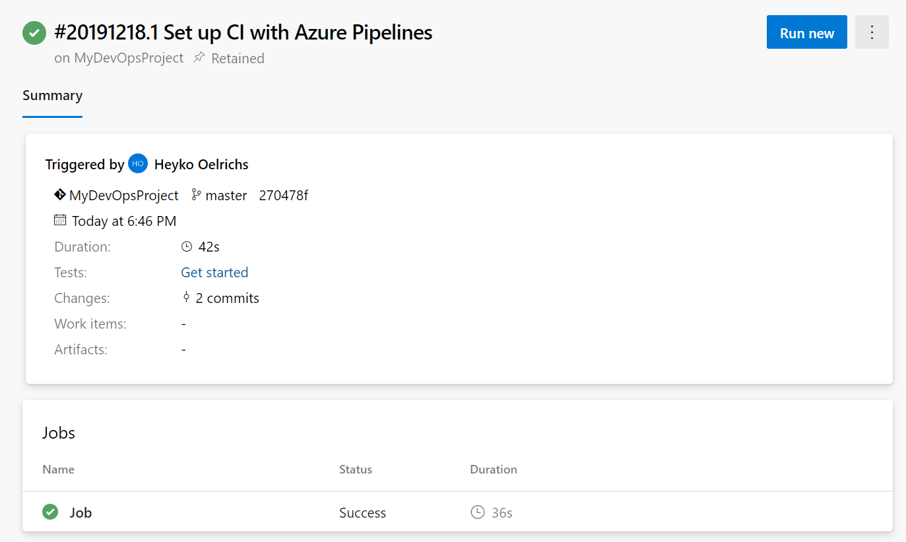

This is the summary of a specific pipeline run. You can come back at any time to lookup the status and the output of a specific pipeline run.

> **What is a Branch?**  
> Branches are lightweight references that keep a history of commits and provide a way to isolate changes for a feature or a bug fix from your master branch and other work. Committing changes to a branch doesn't affect other branches. You can push and share branches with other people on your team without having to merge the changes into master.  
> To learn more about branches, goto [docs.microsoft.com](https://docs.microsoft.com/azure/devops/repos/get-started/key-concepts-repos?view=azure-devops#branch).

## 1.3 Analyze the output

The previously created pipeline was very basic. It does not contain much more than a one-line script that prints out "Hello World" and a multi-line script that prints out two lines with very basic echo commands.

Let us now have a deeper look into the output of your pipeline.

1. Click on "Pipelines" > "Pipelines"
1. Click on your pipeline in "Recently run pipelines"

    

    In this dialog you'll now see all runs of your selected pipeline.

1. Select the last pipeline run

    Here you'll now see the details of the last pipeline run:

    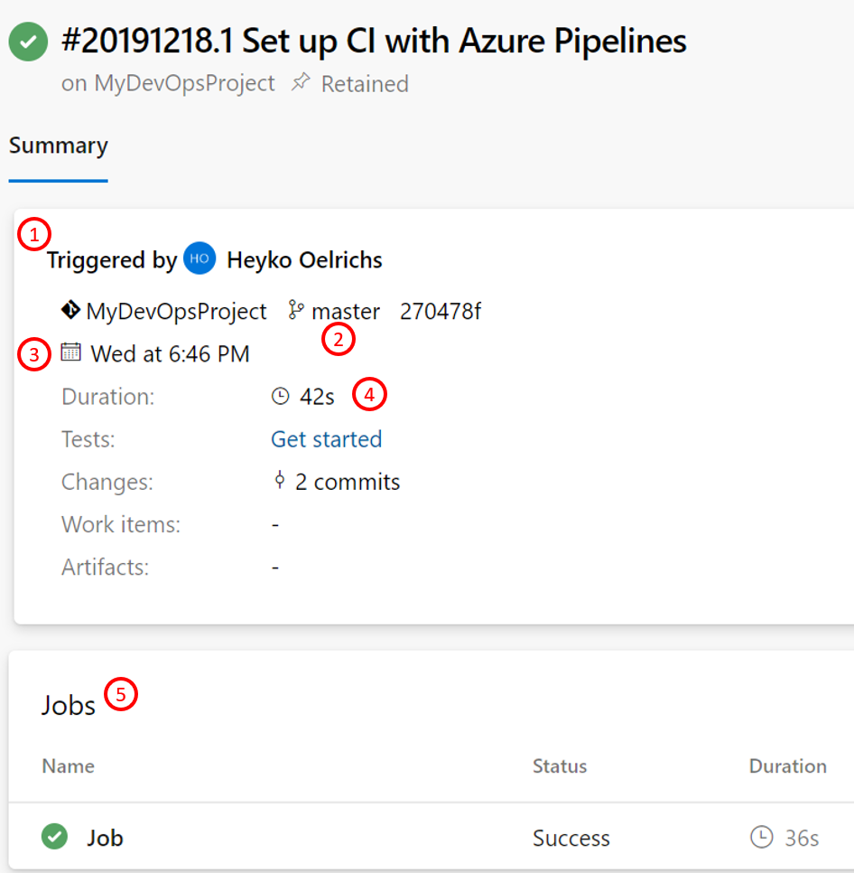

    This dialog shows you some important information, like:

    1. Who has triggered the pipeline
    2. The branch (here master)
    3. Start date/time
    4. Duration
    5. Jobs and their status

    To get even more insights about the jobs,

1. click on "Job"

    in the "Jobs" section. This will bring you to the job details:

    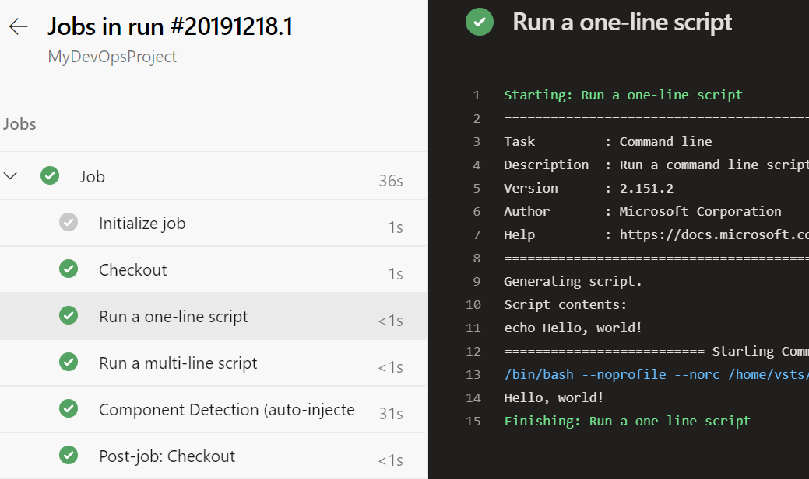

    Here you can now get deeper insights into each indiviual job and their tasks and steps.

1. Click on "Run a one-line script"

    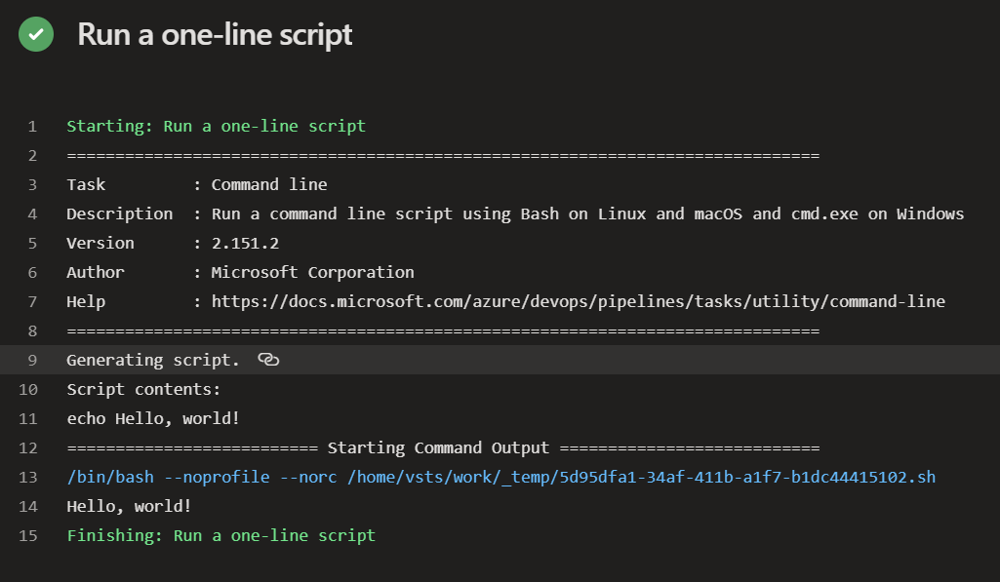

1. Click on "view raw log" to view the complete logs.

    

## 1.4 Use the assistant to add tasks

Now that we've a better understanding of where to find what, we're going to extend our pipeline a bit.

1. Click "Pipelines" > "Pipelines"
1. Select your "Pipeline"
1. Click on "Edit" (top right)

    This will bring us back to the pipeline editor we've seen before.

    To get a better understanding of how to work with tasks and how to extend your pipeline, we're now going to add a third "bash" task to our pipeline.

1. Put your cursor at the end of the pipeline
1. Search in the "Tasks" section for "bash"

    

1. Click on "Bash"
1. Select Type "Inline"
1. Modify the "Script" section with an individual comment

    

1. Click on "Add"

    We can now see that there was a new section added to our YAML pipeline:

    > Note: You may experience indentation errors demarked by red and yellow lines. Use the backspace option to correct the indentation until the red and yellow lines are gone.

    

1. Click on "Save" (top right) to save your changes

    We again see that you can now specify a "Commit message" and an optional "extended description". Leave everything as is and "Commit directly to the master branch".

1. Click "Save"

    Our changes were now saved into our Repository (master branch) and you can now

1. Click "Run" (top right) to run the modified pipeline

    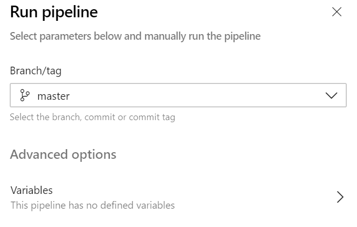

1. Select the "master" branch and click "Run"

    You can now (as learned in Lab 1.3) have a deeper look into the job output to make sure that our new bash task works as expected:

    

    

## 1.5 Extend your pipeline with variables

In our next step, we now want to make our pipeline a bit more dynamic and flexible, to achieve this we start working with variables instead of using hardcoded values.

> **What is a variable?**  
> Variables give you a convenient way to get key bits of data into various parts of the pipeline. As the name suggests, the value of a variable may change from run to run or job to job of your pipeline. Almost any place where a pipeline requires a text string or a number, you can use a variable instead of hard-coding a value. The system will replace the variable with its current value during the pipeline's execution.  
> Goto [docs.microsoft.com](https://docs.microsoft.com/azure/devops/pipelines/process/variables) to learn more.

There are several ways to store and call variables. We are starting with a very simple way. We store our variable in our pipeline.

1. Goto "Pipelines" > "Pipelines"
1. Select our "Pipeline"
1. Click on "Edit" to edit the pipeline
1. Click on "Variables" (top right)

    

1. Click on "New variable"
1. Specify Name: "variable1"
1. Specify Value: "this comes from a pipeline variable"

    

    Here you can also specify a few more things, but for now we leave everything as it is.

1. Click on "OK" to save our new variable
1. Click on "Save" to save the modified pipeline variables

    Let's now modify our pipeline to leverage the newly created variable.

1. Add a new line after 'Greetings from Seattle!'

    ```bash
    echo 'Variable: $(variable1)'
    ```

    Your pipeline should now look like this:

    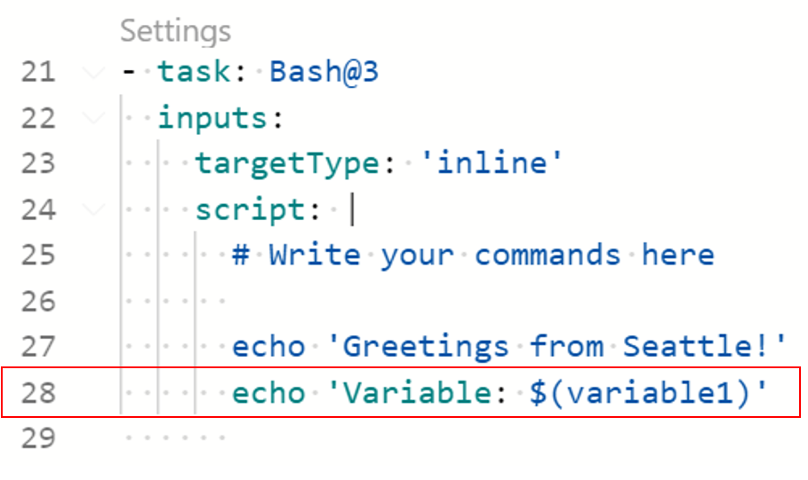

    Let us now save and run our pipeline to see the changes in action:

1. Click "Save" (top right)
1. "Commit directly to the master branch"
1. Click "Save"
1. Click "Run" (top right)
1. Run pipeline on "master"
1. Click "Run"

    When you are now checking the pipeline outputs, you should see the value of your variable there:

    

## 1.6 Check the pipeline within your repository

In all our previous steps we have always modified our pipeline in the "Pipelines" > "Pipelines" section using the Pipeline Editor within our browser. But that is not the only way. One of the benefits of using a YAML-based pipeline is that it is stored within an Azure Repo.

Let us now have a look on our Pipeline in our Azure Repo:

1. Click on "Repos"
1. Click on "Files"

    You should now see a file called `azure-pipelines.yml` in your repositories root directory:

    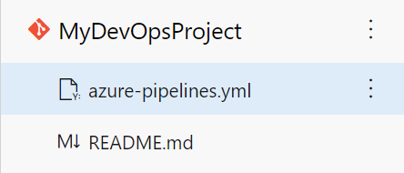

    You can edit the pipeline here, too, but without the additional capabilities of the Pipeline Editor like adding tasks for example that we saw before:

    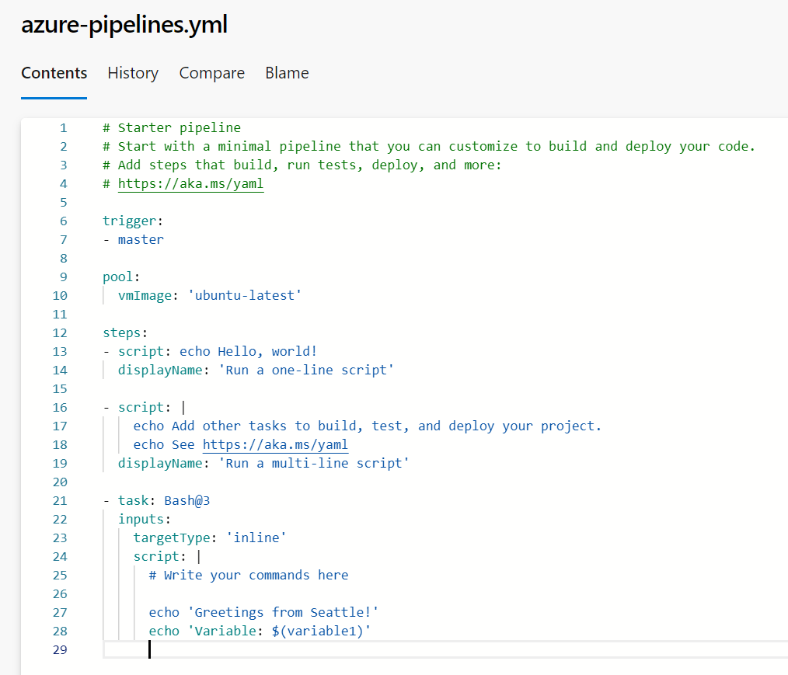

Let's now continue with [Lab 2](/labs/lab2/lab2.md) or go back to the [Overview page](/README.md).
