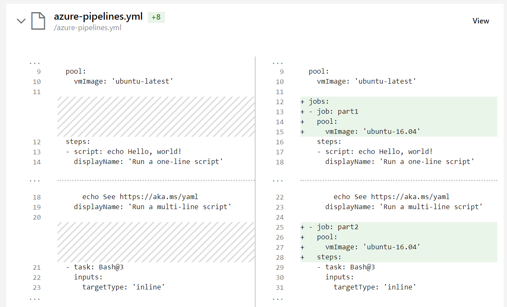
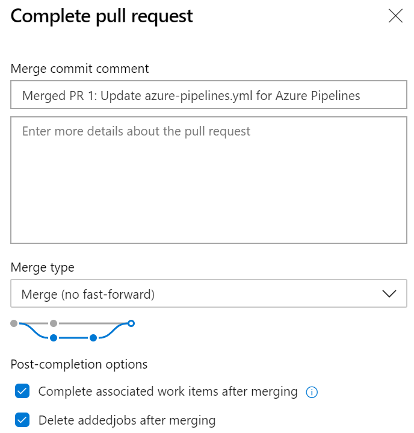
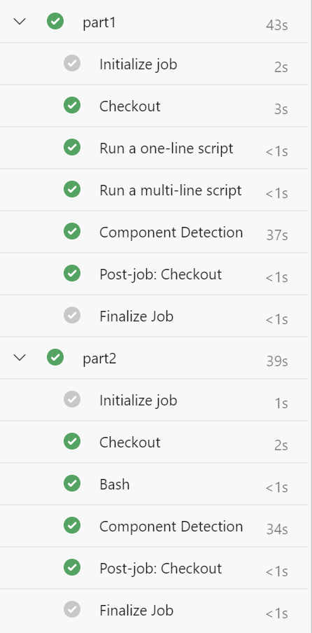
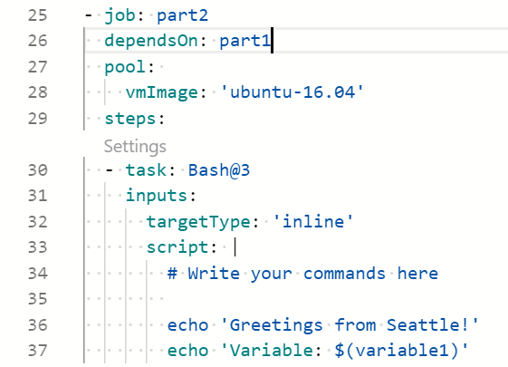

# Lab 2 - Tasks, Jobs, Stages and Dependencies

In [Lab 1](/labs/lab1/lab1.md) we have learned how to build a simple pipeline using Azure DevOps. In this lab we are going a bit deeper working with more advanced functionality.

In case you haven't finished [Lab 1](/labs/lab1/lab1.md), please go back and finish it first.

## 2.1 Separating Tasks into different Jobs

At the end of [Lab 1](/labs/lab1/lab1.md), our pipeline had three tasks. All of them were executed in a single job. But what is a job?

> **What is a job?**  
> You can organize your pipeline into jobs. Every pipeline has at least one job. A job is a series of steps that run sequentially as a unit. In other words, a job is the smallest unit of work that can be scheduled to run.  
> See [docs.microsoft.com](https://docs.microsoft.com/azure/devops/pipelines/process/phases?view=azure-devops&tabs=yaml) for more information.

In our previous lab we've created a pipeline using the wizard. The wizard creates a pipeline with a single job. Like this:

```YAML
pool:
  vmImage: 'ubuntu-16.04'
steps:
- bash: echo "Hello world"
```

This example shows a single job, using Ubuntu 16.04, containing a single task "bash". We now want to split our previously created pipeline into two jobs.

* Goto "Pipelines" > "Pipelines"
* Select our "MyDevOpsProject" pipeline
* Click "Edit"

We now want to separate the last task into a separate job. To achieve this we're now replacing the existing pipeline with the following one:

```YAML
trigger:
- master

jobs:
- job: part1
  pool:
    vmImage: 'ubuntu-16.04'
  steps:
  - script: echo Hello, world!
    displayName: 'Run a one-line script'

  - script: |
      echo Add other tasks to build, test, and deploy your project.
      echo See https://aka.ms/yaml
    displayName: 'Run a multi-line script'

- job: part2
  pool:
    vmImage: 'ubuntu-16.04'
  steps:
  - task: Bash@3
    inputs:
      targetType: 'inline'
      script: |
        # Write your commands here
        echo 'Greetings from Seattle!'
        echo 'Variable: $(variable1)'
```

* Click on "Save"
* Select "Create a new branch for this commit"
* Call it "addedjobs"


* Select "Start a pull request"
* Click "Save"

This will now save our changes in a separate branch and create a pull request. That allows us to review our changes.

* Goto "Repos"
* Click "Pull requests" (make sure that you're in the correct repo)
* Select the pull request in "Created by me"
* Click on "Files"

This will now show us the difference between the previous and the modified pipeline:



To complete the PR and merge our changes into master you can now click "Complete". And click "Complete merge".

The default setting is to delete your newly created branch after merging. Leave it as it is.



Merging our PR should now automatically start a new pipeline run. Let's take a look:

* Click "Pipelines" > "Pipelines"
* Select our pipeline
* Select the last run

And here you'll already see that our pipeline is now splitted into two different jobs:


As we haven't specified any dependencies our two jobs can run in parallel and without a specific order. In aboves screenshot part2 is already finished while part1 wasn't even started.

When you click on one of the jobs, you can see more details about the steps and tasks within each of your jobs:



Jobs are a great feature to run tasks in parallel, in a specific order or on different platforms (Windows, Linux, ..).

Before we now proceed with the next task, let's add a dependency to make sure that part1 is executed before part2 in our pipeline.

## 2.2 Adding dependencies between Jobs

Let's go back to our pipeline and add a dependency:

* Goto "Pipelines" > "Pipelines"
* Select our pipeline
* Click "Edit"
* Add a new line after line 25

```YAML
- job: part2
  dependsOn: part1
```

> Make sure that dependsOn is aligned with job.



* Click "Save"
* Select "Commit directly to the master branch"
* Click "Save"

This will trigger a new run of our pipeline.

* Goto "Pipelines" > "Pipelines"
* Select our pipeline
* Select the last run

Here you'll see now, that part1 will be executed first and part2 will start after part1 was successfully finished.


## 2.3 Splitting our pipeline into Stages

Now that we had a quick intro into jobs we'll now continiue with stages.

> **What are stages?**  
> You can organize the jobs in your pipeline into stages. Stages are the major divisions in a pipeline: "build this app", "run these tests", and "deploy to pre-production" are good examples of stages. They are a logical boundary in your pipeline at which you can pause the pipeline and perform various checks.  
> Every pipeline has at least one stage even if you do not explicitly define it. Stages may be arranged into a dependency graph: "run this stage before that one".  
> Goto [docs.microsoft.com](https://docs.microsoft.com/azure/devops/pipelines/process/stages) to learn more.

A stage can contain one or more jobs. Here's an example how this could look like:

```YAML
stages:
- stage: A
  jobs:
  - job: A1
  - job: A2

- stage: B
  jobs:
  - job: B1
  - job: B2
```

## 2.3 Adding Dependencies between Jobs and Stages
