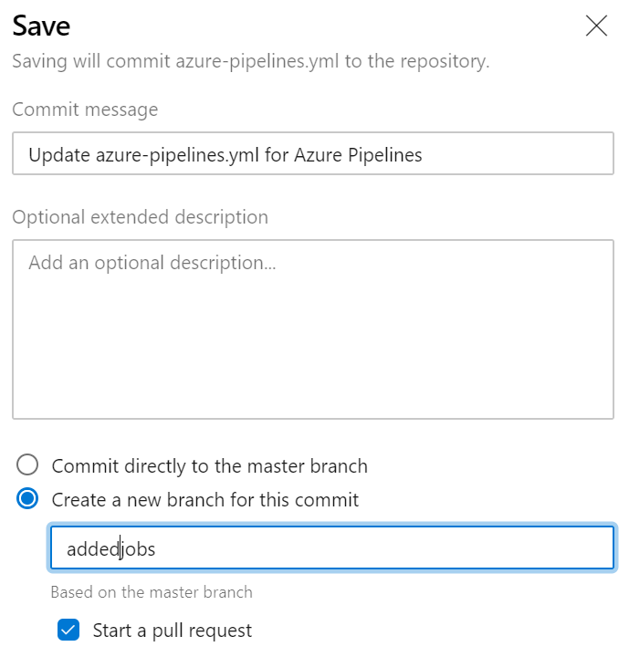

# Lab 2 - Tasks, Jobs, Stages and Dependencies

In [Lab 1](/labs/lab1/lab1.md) we have learned how to build a simple pipeline using Azure DevOps. In this lab we are going a bit deeper working with more advanced functionality.

In case you haven't finished [Lab 1](/labs/lab1/lab1.md), please go back and finish it first.

## 2.1 Separating Tasks into different Jobs

At the end of [Lab 1](/labs/lab1/lab1.md), our pipeline had three tasks. All of them were executed in a single job. But what is a job?

> **What is a job?**<br>
>You can organize your pipeline into jobs. Every pipeline has at least one job. A job is a series of steps that run sequentially as a unit. In other words, a job is the smallest unit of work that can be scheduled to run.<br>
>See [docs.microsoft.com](https://docs.microsoft.com/azure/devops/pipelines/process/phases?view=azure-devops&tabs=yaml) for more information.

In our previous lab we've created a pipeline using the wizard. The wizard creates a pipeline with a single job. Like this:

```YAML
pool:
  vmImage: 'ubuntu-16.04'
steps:
- bash: echo "Hello world"
```

This example shows a single job, using Ubuntu 16.04, containing a single task "bash". We now want to split our previously created pipeline into two jobs.

* Goto "Pipelines" > "Pipelines"
* Select our "MyDevOpsProject" pipeline
* Click "Edit"

We now want to separate the last task into a separate job. To achieve this we're now replacing the existing pipeline with the following one:

```YAML
trigger:
- master

jobs:
- job: part1
  pool:
    vmImage: 'ubuntu-16.04'
  steps:
  - script: echo Hello, world!
    displayName: 'Run a one-line script'

  - script: |
      echo Add other tasks to build, test, and deploy your project.
      echo See https://aka.ms/yaml
    displayName: 'Run a multi-line script'

- job: part2
  pool: 
    vmImage: 'ubuntu-16.04'
  steps:
  - task: Bash@3
    inputs:
      targetType: 'inline'
      script: |
        # Write your commands here
        echo 'Greetings from Seattle!'
        echo 'Variable: $(variable1)'
```

* Click on "Save"
* Select "Create a new branch for this commit"
* Call it "addedjobs"



* Select "Start a pull request" 
* Click "Save"

This will now save our changes in a separate branch and create a pull request. That allows us to review our changes.

* Goto "Repos"
* Click "Pull requests" (make sure that you're in the correct repo)
* Select the pull request in "Created by me"
* Click on "Files"

This will now show us the difference between the previous and the modified pipeline:


To complete the PR and merge our changes into master you can now click "Complete". And click "Complete merge".

The default setting is to delete your newly created branch after merging. Leave it as it is.


Merging our PR should now automatically start a new pipeline run. Let's take a look:

* Click "Pipelines" > "Pipelines"
* Select our pipeline
* Select the last run

And here you'll already see that our pipeline is now splitted into two different jobs:


As we haven't specified any dependencies our two jobs can run in parallel and without a specific order. In aboves screenshot part2 is already finished while part1 wasn't even started.

When you click on one of the jobs, you can see more details about the steps and tasks within each of your jobs:


## 2.2 Splitting our pipeline into Stages

## 2.3 Adding Dependencies between Jobs and Stages