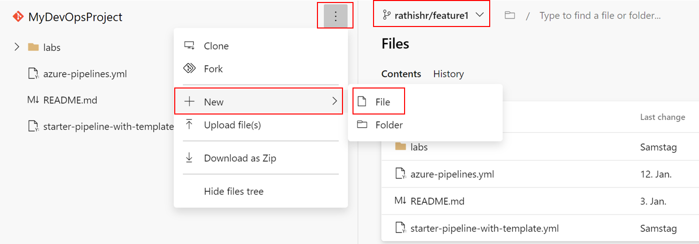
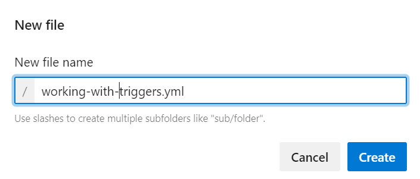

# Lab 4 - Triggers

Any DevOps lifecycle comprises of bunch of process that run at different stages of the lifecycle consuming and exposing data through various channels. Triggers enable customer to orchestrate the DevOps process in an efficient manner by automating the CI/CD process.

Triggers are events on which you can start your pipeline run automatically. You can enable triggers on your pipeline by subscribing to both internal and external events. An event can be completion of a process, availability of a resource, status update from a service or a timed event.

**Scenarios**

* I would like to trigger my pipeline when an artifact is published by ‘Helm-CI’ pipeline that ran on releases/* branch.
* I would like to trigger my pipeline only when a new commit goes into the file path “Repository/Web/*”.
* I would like to trigger my pipeline only when a PR is targeted to releases/* branch of the repository.


Lets have a look at how we would work with triggers.

# 4. 1 Working with triggers and branches

**Scenario**

***I would like to trigger my pipeline when a commit is made to a certain branch.**

First lets create a couple of branches to work with.

* Goto Repos > Branches
* Click "New branch"
* Give it a suitable name for example rathishr/feature1
* Click "Create"
* Similarly create another branch for example heyko/feature2


Once done your branches will look similar to the below


Next lets create a new pipeline, this time from the repos.

* Goto Repos > Files
* Select one of the feature branch you created above for example **rathishr/feature1**



* Give the file a suitable name like "working-with-triggers.yml"



* Click "Create"
* Copy paste the below content.

```
# Starter pipeline
# Start with a minimal pipeline that you can customize to build and deploy your code.
# Add steps that build, run tests, deploy, and more:
# https://aka.ms/yaml

trigger:
  branches:
    include:
    - rathishr/*
    exclude:
    - master
    - heyko/*

pool:
  vmImage: 'ubuntu-latest'

steps:
- script: echo Hello, world!
  displayName: 'Run a one-line script'

- script: |
    echo Add other tasks to build, test, and deploy your project.
    echo See https://aka.ms/yaml
  displayName: 'Run a multi-line script'
  ```
  * Click "Commit" twice.
  * Click Pipelines>Pipelines
  * Click New Pipeline
  * Select Azure Repos Git (YAML)
  * Select your repository
  * Select "Existing Azure Pipelines YAML file"
  * Select feature branch "rathishr/feature1" and path as "/working-with-triggers.yml"
  
  
  
  * Click "Continue"
  * We will not run the pipeline yet, instead from the drop click "Save"
  
  
  
Notice carefully that you are creating a trigger based on  changes made to a branch and inlcuding one branch and excluding two others.

* At this point we are only going to save this pipeline and run later. Hence click on the drop down "Save and Run" and Click on "Save"


* Click "Save" again.
* Go to Pipelines > Pieplines
* Click on "All" to view the pipeline we just created.
* Click and rename the pipeline as done in the previous labs.
* Give it a suitable name like for example "Working with triggers"
* Click "Save"

Next lets put this to action. Lets make a change to our code/content in branch **rathishr/feature1**

* Goto Repos> Files
* Change the branch from "master" to "rathishr/feature1"


* Click on the three dots and select **New**>**Folder**


* Provide a name to the folder and also a file name. Click "Create"


* Type some sample text on the ReadMe.md edit window and Click "Commit"
* Click "Commit" again! Ensure that you have the correct "branch name" selected.
* Click Commit"


# 4.2 Working with triggers and path

# 4.3 Working with triggers and PR
