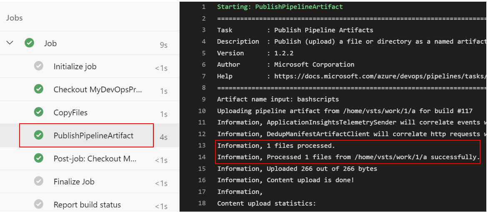

# Lab 5 - CI and CD

In this lab we are going to implement a build pipeline that creates versioned artifacts that can be used by multiple other release pipelines afterwards.

> You can publish and consume many different types of packages and artifacts with Azure Pipelines. Your continuous integration/continuous deployment (CI/CD) pipeline can publish specific package types to their respective package repositories (NuGet, npm, Python, and so on). Or you can use build artifacts and pipeline artifacts to help store build outputs and intermediate files between build steps. You can then add onto, build, test, or even deploy those artifacts. Goto [docs.microsoft.com](https://docs.microsoft.com/azure/devops/pipelines/artifacts/artifacts-overview?view=azure-devops) to learn more.

## 5.1 Build pipelines and artifacts

Let us start with a build pipeline that creates and publishes build artifacts for us.

1. Goto Repos > Branches
1. Create a new branch "lab5" that is based on master
1. Goto Pipelines > Pipelines
1. Click on "New pipeline"
1. Click on "Azure Repos Git (YAML)"
1. Select our repository
1. Select "Existing Azure Pipelines YAML file"

    * Select the lab5 branch
    * Paste `labs/lab5/examples/build.pipeline.yaml`

1. Click on "Continue"

    You will now see a very simple build pipeline that does two things:

    * Copy all files that end with *.sh (shell script)
    * Publish these files as build artifacts

    

1. Click on "Run"
1. Click on "Job" to check the job details
1. Check the "CopyFiles" task

    You will see that our CopyFiles task found 1 file and copied it into out staging directory.

    

1. Next, check the "PublishPipelineArtifact" task

    You will see here that it has published 1 file. This is the file that was copied in the previous step.

    

This concludes Lab 5. Let's now go back to the [Overview](/README.md).
